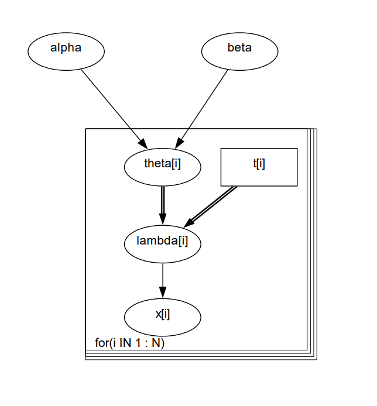

```{r setup, include=FALSE}
# --- Libraries
suppressPackageStartupMessages({
  library(knitr); library(readr); library(here)
  library(dplyr); library(tidyr); library(ggplot2)
  library(coda);  library(rjags)
  library(DAGnabit)
})

# --- knitr defaults + knit from repo root
knitr::opts_chunk$set(collapse = TRUE, comment = "#>", message = FALSE, warning = FALSE,
                      fig.width = 7, fig.height = 4.8)
#knitr::opts_knit$set(root.dir = rprojroot::find_package_root_file())
cat("Vignette ROOT =", here::here(), "\n")

# --- tiny helpers used by the vignettes -----------------------------

# Prefer an installed package file (inst/...) if available; otherwise fall back to repo paths
pkg_file <- function(...) {
  p <- system.file(..., package = "DAGnabit")
  if (nzchar(p)) return(p)           # when knitting after install/build
  file.path("inst", ...)             # when knitting from source
}

# Build a path from the repo root
rp <- function(...) here::here(...)

# Read CSV from a repo path with a sanity check
rp_csv <- function(...) {
  p <- rp(...)
  stopifnot(file.exists(p))
  readr::read_csv(p, show_col_types = FALSE)
}

# Locate a fixture file:
#   1) inst/extdata/examples/<example>/<file>  (after install/build)
#   2) tests/testthat/<fixtures-or-parser-examples>/<example>/<file>  (from source)
find_fixture <- function(example, fname) {
  # Prefer packaged location
  p <- pkg_file("extdata", "examples", example, fname)
  if (nzchar(p) && file.exists(p)) return(p)

  # Choose the right dev directory name automatically
  dev_dir <- if (dir.exists(rp("tests", "testthat", "fixtures", example))) {
    "fixtures"
  } else {
    "parser-examples"
  }

  rp("tests", "testthat", dev_dir, example, fname)
}

# Read a fixture (nodes/edges tables)
read_fixture <- function(example, fname) {
  readr::read_csv(find_fixture(example, fname), show_col_types = FALSE)
}
set.seed(123)

```

```{r load-fixtures,  eval=FALSE}
pumps_nodes <- rp_csv("tests","testthat","fixtures","pumps","nodes.csv")
pumps_edges <- rp_csv("tests","testthat","fixtures","pumps","edges.csv")
```

### Overview
The Pumps example models failures in ten power-plant pumps using a hierarchical Gamma–Poisson setup that naturally accounts for differing exposure times. Each pump’s observed failures (x_i) follow a Poisson distribution with mean (lambda_i) = (theta_i) * (t_i), where (theta_i) is the failure rate for pump i and (t_i) is the length of operation time of the pump. To borrow strength across pumps, the rates share a common prior (theta_i) ~ Gamma(alpha, beta), with weakly informative hyperpriors such as (alpha) ~ Exponential(1.0) and (beta) ~ Gamma(0.1, 1.0). Fitted with JAGS, the model yields posterior estimates for the population hyperparameters (alpha), (beta) and each pump's rate (theta_i), delivering partial pooling that stabilizes noisy per-pump estimates when data are sparse. Typical outputs include a summary table of posteriors and a simple fit check plotting observed counts (x_i) against posterior mean (lambda_i) (points near the 45° line indicate a good match).

### A) Original BUGS model

> The Pumps example (conjugate Gamma–Poisson hierarchical model) as presented in the WinBUGS help examples.

```{r pumps-bugs, eval=FALSE}
paths <- c(
  system.file("extdata/winbugs/pumps_model.bug", package = "DAGnabit"),
  "inst/extdata/winbugs/pumps_model.bug",
  "../inst/extdata/winbugs/pumps_model.bug",
  "../../inst/extdata/winbugs/pumps_model.bug"
)
paths <- paths[nzchar(paths)]
p <- paths[which(file.exists(paths))[1]]
if (!length(p)) {
  cat("Missing file: Please add inst/extdata/winbugs/pumps_model.bug to the package and re-knit.\n")
} else {
  cat(paste(readLines(p, warn = FALSE), collapse = "\n"))
}
```

### B) Official WinBUGS diagram

```{r pumps-diagram, echo=FALSE, fig.cap="Official WinBUGS 'Pumps' graphical model"}

```


### C) Nodes and Edges

```{r rats-fixtures, eval=FALSE, message=FALSE, warning=FALSE}
find_fixture <- function(example, fname) {
  # 1) prefer inst/extdata when built/installed
  p1 <- pkg_file("extdata", "examples", example, fname)
  if (file.exists(p1)) return(p1)

  # 2) fallback(s) for local dev
  p2 <- rp("tests", "testthat", "fixtures",          example, fname)
  if (file.exists(p2)) return(p2)

  p3 <- rp("tests", "testthat", "parser-examples",   example, fname)
  if (file.exists(p3)) return(p3)

  stop("Fixture not found in inst/extdata or tests/testthat/* for ",
       example, "/", fname)
}

read_fixture <- function(example, fname) {
  readr::read_csv(find_fixture(example, fname), show_col_types = FALSE)
}

# ---- Pumps ----
pumps_nodes <- read_fixture("pumps", "nodes.csv")
pumps_edges <- read_fixture("pumps", "edges.csv")

# ---- Rats ----
rats_nodes  <- read_fixture("rats",  "nodes.csv")
rats_edges  <- read_fixture("rats",  "edges.csv")

# quick sanity
list(pumps = c(n_nodes = nrow(pumps_nodes), n_edges = nrow(pumps_edges)))
```


### D) Package recreation (fit + outputs)

We fit the Gamma–Poisson hierarchical model with JAGS:
xi ~ Poisson(theta_i*t_i), i = 1,...,10
theta_i ~ Gamma(alpha, beta), i = 1,...,10
alpha ~ Exponential(1.0)
beta ~ Gamma (0.1, 1.0)

Operation times (thousands of hours) and failure counts from WinBUGS help.

## Data
```{r pumps-data}

t <- c(94.3, 15.7, 62.9, 126.0, 5.24, 31.4, 1.05, 1.05, 2.1, 10.5)
x <- c(   5,   1,    5,   14,   3,   19,   1,   1,   4,   22)
N <- length(x)

pumps_df <- tibble::tibble(pump = factor(seq_len(N)), t, x)
knitr::kable(pumps_df, caption = "Pumps data (operation time t and failures x).")
```

### JAGS model 

```{r pumps-model}
pumps_model <- "
model {
for (i in 1:N) {
x[i] ~ dpois(lambda[i])
lambda[i] <- theta[i] * t[i]
theta[i] ~ dgamma(alpha, beta)
}

# hyperpriors

alpha ~ dexp(1.0)
beta  ~ dgamma(0.1, 1.0)
}
"

jags_data <- list(x = x, t = t, N = N)

# mild, dispersed inits

make_inits <- function() list(
theta = pmax(x / pmax(t, 1e-6), 1e-3),  # crude rates
alpha = 1,
beta  = 1
)

params <- c("alpha","beta","theta")
```

### Fit & sample

```{r pumps-fit, results='hide', message=TRUE, message=TRUE, eval=requireNamespace("rjags", quietly=TRUE)}
mod <- rjags::jags.model(
textConnection(pumps_model),
data  = jags_data,
inits = list(make_inits(), make_inits(), make_inits()),
n.chains = 3,
n.adapt  = 1000
)

update(mod, 2000)  # burn-in
samp <- rjags::coda.samples(
model = mod,
variable.names = params,
n.iter = 10000,
thin = 5
)
```

```{r pumps-summaries, eval=exists("samp")}
s <- summary(samp)
tab <- cbind(
  s$statistics[, c("Mean","SD")],
  s$quantiles[, c("2.5%","50%","97.5%")]
)
wanted <- c("alpha","beta", paste0("theta[", seq_len(N), "]"))
knitr::kable(round(tab[wanted, , drop=FALSE], 4),
             caption = "Posterior summaries for alpha, beta and theta[1:N].")
```

### Diagnostics

```{r pumps-diagnostics, eval=exists("samp")}
coda::gelman.diag(samp[, c("alpha","beta")])
coda::autocorr.plot(samp[, c("alpha","beta")])
```

### Fitted lines vs data

```{r pumps-fitted, eval=exists("samp")}
m <- do.call(rbind, samp)

# posterior means of theta[i]

theta_cols <- grepl("^theta\\[[0-9]+\\]$", colnames(m))
theta_mean <- colMeans(m[, theta_cols, drop = FALSE])

plot_df <- tibble::tibble(
pump = factor(seq_len(N)),
t = t,
x = x,
theta_hat = as.numeric(theta_mean),
lambda_hat = theta_hat * t
)

ggplot2::ggplot(plot_df, ggplot2::aes(x = lambda_hat, y = x, label = pump)) +
ggplot2::geom_abline(slope = 1, intercept = 0, linetype = 2) +
ggplot2::geom_point(size = 2) +
ggplot2::geom_text(nudge_y = 0.4, size = 3) +
ggplot2::labs(x = expression("Posterior mean " * lambda[i] == theta[i] %.% t[i]),
              y = expression("Observed failures " * x[i]))
```


